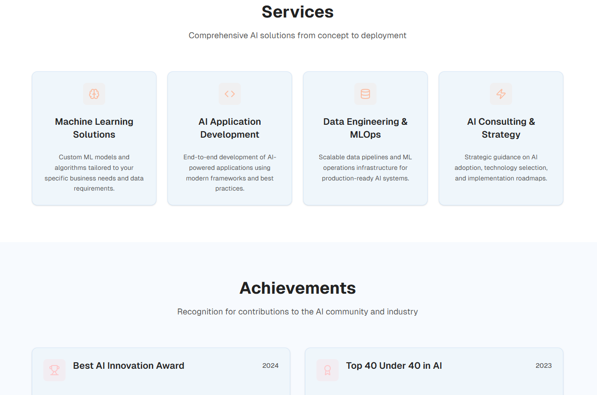
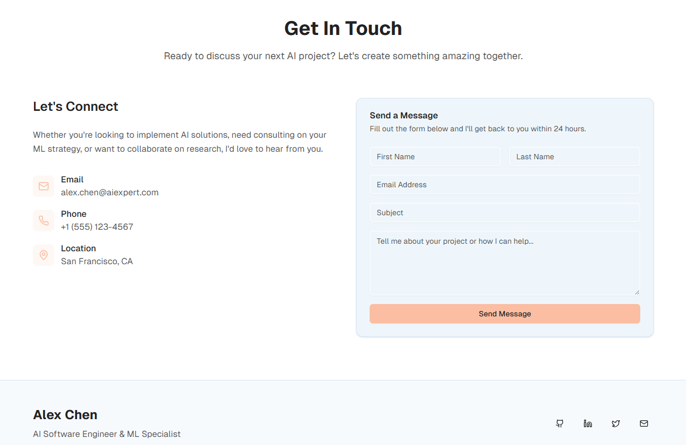
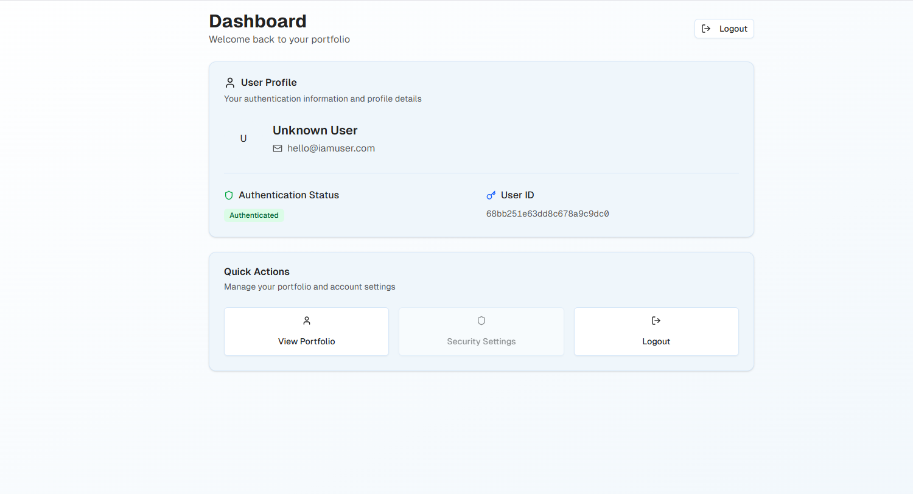

# Modern Portfolio Website - Next.js with SSOJet Authentication

A sleek, modern portfolio website built with Next.js 14, TypeScript, Tailwind CSS, and Radix UI components. Features a clean design with dark/light mode support, professional layout, and secure SSOJet authentication integration for admin access.

## 🚀 Features

- **Modern Tech Stack**: Built with Next.js 14, TypeScript, and Tailwind CSS
- **SSO Authentication**: Secure login with SSOJet OIDC integration
- **Protected Routes**: Admin dashboard with authentication guards
- **Responsive Design**: Mobile-first approach with beautiful UI components
- **Dark/Light Mode**: Theme switching with next-themes
- **Component Library**: Extensive use of Radix UI components
- **Performance Optimized**: Fast loading with Vercel Analytics integration
- **Accessible**: WCAG compliant with proper semantic markup
- **Professional Sections**:
  - Hero section with introduction
  - About section with personal details
  - Services offered
  - Achievements and milestones
  - Blog/Articles section
  - Client testimonials
  - Contact information
  - Footer with social links
  - Admin login and dashboard

## 📸 Screenshots

### Homepage - Light Mode


### Homepage - Dark Mode


### Services Section


### About & Achievements


### Contact & Footer


### Dashboard after login


## 🛠️ Tech Stack

- **Framework**: [Next.js 14](https://nextjs.org/) with App Router
- **Language**: [TypeScript](https://www.typescriptlang.org/)
- **Authentication**: [SSOJet](https://ssojet.com/) with OIDC Client
- **Styling**: [Tailwind CSS](https://tailwindcss.com/)
- **UI Components**: [Radix UI](https://www.radix-ui.com/)
- **Theme Management**: [next-themes](https://github.com/pacocoursey/next-themes)
- **Icons**: [Lucide React](https://lucide.dev/)
- **Animations**: Tailwind CSS Animate
- **Form Handling**: React Hook Form with Zod validation
- **Package Manager**: pnpm
- **Analytics**: Vercel Analytics

## 📋 Prerequisites

Before you begin, ensure you have the following installed:

- **Node.js** (version 18.0 or higher)
- **pnpm** (recommended) or npm or yarn
- **Git**
- **SSOJet Account** (for authentication setup)

## 🔧 Installation

1. **Clone the repository**
   ```bash
   git clone https://github.com/pierre-mystic/portfolio-site-nextjs-ssojet-auth.git
   cd portfolio-site-nextjs-ssojet-auth
   ```

2. **Install dependencies**
   ```bash
   pnpm install
   # or
   npm install
   # or
   yarn install
   ```

3. **Set up environment variables**
   
   Copy the `.env.local` file and update with your SSOJet credentials:
   ```env
   # SSOJet Configuration
   NEXT_PUBLIC_SSOJET_AUTHORITY_URL=https://auth.ssojet.com
   NEXT_PUBLIC_SSOJET_CLIENT_ID=your-actual-client-id
   NEXT_PUBLIC_SSOJET_REDIRECT_URI=http://localhost:3000/login/ssocallback

   # Site Configuration
   NEXT_PUBLIC_SITE_URL=http://localhost:3000
   NEXT_PUBLIC_SITE_NAME="Your Portfolio Name"
   ```

4. **Run the development server**
   ```bash
   pnpm dev
   # or
   npm run dev
   # or
   yarn dev
   ```

5. **Open your browser**
   
   Navigate to [http://localhost:3000](http://localhost:3000) to see the website.

## ⚙️ Configuration

### SSOJet Authentication Setup

This application uses SSOJet for secure authentication. Follow these steps to set up authentication:

#### 1. **Create SSOJet Account**
- Visit [SSOJet](https://ssojet.com) and create an account
- Follow the [SSOJet documentation](https://docs.ssojet.com/en/sso/quickstart/fullstack/nextjs/) for detailed setup

#### 2. **Configure Your Application**
- In your SSOJet dashboard, create a new application
- Set the redirect URI to: `http://localhost:3000/login/ssocallback`
- For production, use: `https://yourdomain.com/login/ssocallback`
- Note down your Client ID and Authority URL

#### 3. **Configuration Setup**

The application uses a centralized configuration file (`lib/config.ts`) with environment variable fallbacks. You can either:

**Option A: Use Environment Variables** (Recommended for production)
```env
# .env.local
NEXT_PUBLIC_SSOJET_AUTHORITY_URL=https://your ssojet authority url
NEXT_PUBLIC_SSOJET_CLIENT_ID=your-actual-client-id-from-dashboard
SSOJET_CLIENT_SECRET=your-actual-client-secret-from-dashboard
NEXT_PUBLIC_SSOJET_REDIRECT_URI=http://localhost:3000/login/ssocallback
```

**Option B: Update Config File Directly** (For development)
Edit `lib/config.ts` and replace the default values:
```typescript
ssojet: {
  clientId: 'your-actual-client-id',
  authorityUrl: 'your ssojet authority url',
  redirectUri: 'http://localhost:3000/login/ssocallback',
  // ... other settings
}
```

#### 4. **Configuration Structure**

The application configuration is centralized in `lib/config.ts` and includes:

- **Site Settings**: Name, URL, description
- **SSOJet Configuration**: Authentication endpoints and settings
- **Security Settings**: Session timeout, token renewal
- **Debug Settings**: Development logging and validation
- **API Configuration**: Base URLs and timeouts

All settings support environment variable overrides for different deployment environments.

#### 5. **Authentication Flow**
- Users can access the public portfolio without authentication
- Click "Admin Login" on the homepage to access the login page
- Support for both traditional login and SSO authentication
- Protected dashboard route accessible only after authentication
- Automatic token renewal and session management

### Environment Variables

### Customization

#### 1. **Personal Information**
Edit the component files in the `/components` directory to update:
- `hero.tsx` - Your main introduction and hero section
- `about.tsx` - Personal background and bio
- `services.tsx` - Services you offer
- `achievements.tsx` - Your accomplishments and milestones
- `contact.tsx` - Contact information and form

#### 2. **Styling**
- **Colors**: Modify `app/globals.css` for custom color schemes
- **Components**: UI components are in `/components/ui/` directory
- **Fonts**: Currently using Geist font family

#### 3. **Images**
Replace placeholder images in the `/public` directory:
- Add your profile photos
- Update service icons
- Replace achievement images
- Add your project screenshots

### Components Structure

```
components/
├── ui/                    # Reusable UI components (Radix UI based)
├── auth-provider.tsx      # Authentication context provider
├── protected-route.tsx    # Route protection wrapper
├── hero.tsx              # Main hero section
├── about.tsx             # About section
├── services.tsx          # Services offered
├── achievements.tsx      # Achievements showcase
├── blog.tsx             # Blog/Articles section
├── testimonials.tsx     # Client testimonials
├── contact.tsx          # Contact form and info
├── footer.tsx           # Footer with links
└── theme-provider.tsx   # Theme context provider

app/
├── login/
│   ├── page.tsx          # Login page with SSO support
│   └── ssocallback/
│       └── page.tsx      # SSO callback handler
├── dashboard/
│   └── page.tsx          # Protected admin dashboard
├── layout.tsx            # Root layout with providers
└── page.tsx              # Main portfolio page

lib/
├── oidc-config.ts        # OIDC client configuration
└── utils.ts              # Utility functions

hooks/
├── use-auth.ts           # Authentication hook
├── use-mobile.ts         # Mobile detection hook
└── use-toast.ts          # Toast notifications hook
```

## 📦 Available Scripts

- `pnpm dev` - Start development server
- `pnpm build` - Build for production
- `pnpm start` - Start production server
- `pnpm lint` - Run ESLint

## 🎨 UI Components

This project includes a comprehensive set of UI components:

- **Layout**: Card, Separator, Accordion
- **Forms**: Input, Textarea, Select, Checkbox, Radio Group
- **Navigation**: Dropdown Menu, Navigation Menu, Breadcrumb
- **Feedback**: Alert, Toast, Progress, Skeleton
- **Overlay**: Dialog, Popover, Tooltip, Hover Card
- **Data Display**: Table, Badge, Avatar, Calendar
- **Interactive**: Button, Toggle, Switch, Slider

## 🧪 Testing the Authentication

### Local Testing

1. **Start the Development Server**
   ```bash
   pnpm dev
   ```

2. **Test Public Access**
   - Navigate to `http://localhost:3000`
   - Verify the portfolio loads without authentication

3. **Test Authentication Flow**
   - Click "Admin Login" button on the homepage
   - Navigate to `http://localhost:3000/login`
   - Test both traditional and SSO login modes
   - For SSO: Enter email and click "Continue with SSO"
   - Complete authentication on SSOJet's login page
   - Verify redirect to dashboard at `http://localhost:3000/dashboard`

4. **Test Protected Routes**
   - Try accessing `http://localhost:3000/dashboard` without authentication
   - Should redirect to login page
   - After successful login, should display user profile information

5. **Test Logout**
   - From dashboard, click "Logout" button
   - Should redirect to SSOJet logout page and then back to portfolio

### Production Testing

For production deployment, update your environment variables:

```env
NEXT_PUBLIC_SSOJET_REDIRECT_URI=https://yourdomain.com/login/ssocallback
NEXT_PUBLIC_SITE_URL=https://yourdomain.com
```

## 🚀 Deployment

### Vercel (Recommended)

1. Push your code to GitHub
2. Connect your repository to [Vercel](https://vercel.com)
3. Add your environment variables in Vercel dashboard:
   - `NEXT_PUBLIC_SSOJET_AUTHORITY_URL`
   - `NEXT_PUBLIC_SSOJET_CLIENT_ID`
   - `NEXT_PUBLIC_SSOJET_REDIRECT_URI` (with your domain)
   - `NEXT_PUBLIC_SITE_URL` (your production URL)
4. Deploy with zero configuration

### Other Platforms

For deployment on other platforms:

1. **Build the project**
   ```bash
   pnpm build
   ```

2. **Start the production server**
   ```bash
   pnpm start
   ```

## 🔍 SEO Optimization

The site includes:
- Proper meta tags and Open Graph data
- Semantic HTML structure
- Image optimization with Next.js Image component
- Sitemap generation
- Mobile-responsive design

## 🤝 Contributing

1. Fork the repository
2. Create your feature branch (`git checkout -b feature/AmazingFeature`)
3. Commit your changes (`git commit -m 'Add some AmazingFeature'`)
4. Push to the branch (`git push origin feature/AmazingFeature`)
5. Open a Pull Request

## 📄 License

This project is licensed under the MIT License - see the [LICENSE](LICENSE) file for details.

## 👨‍💻 Author

**Pierre Mystic**
- GitHub: [@pierre-mystic](https://github.com/pierre-mystic)
- Portfolio: [Your Portfolio URL]

## 🙏 Acknowledgments

- [Vercel](https://vercel.com) for hosting and deployment
- [Radix UI](https://www.radix-ui.com) for accessible components
- [Tailwind CSS](https://tailwindcss.com) for styling
- [Lucide](https://lucide.dev) for beautiful icons

## 📞 Support

If you have any questions or need help with setup, please open an issue or contact me directly.

---

⭐ Don't forget to give this project a star if you found it helpful!
